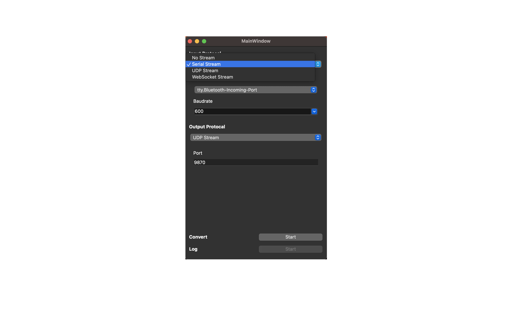

# Abstruct
This repository is a tool to convert communication protocol and log stream
- Enable to convert Serial, UDP and Webscoket protocol (add other protocol like TCP soon)
- Simple interface

# How to use

1\. Select input stream and options like port 

2\. Select output stream and options like port

3\. Click "Convert Start" to start convertion

4\. Click "Log Start" to log stream while converting(Save to home folder)

# Requirement(Checked Env)
## OS
MacOS
## Library
Qt5 (install from brew)

# Build
... Getting Ready ...